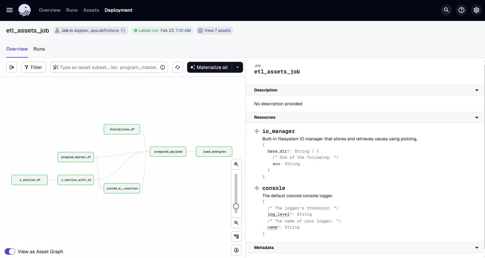
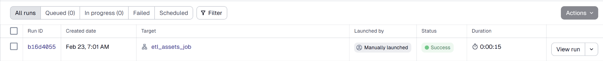
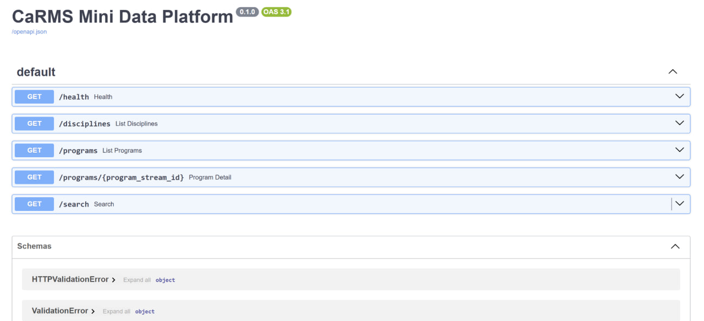
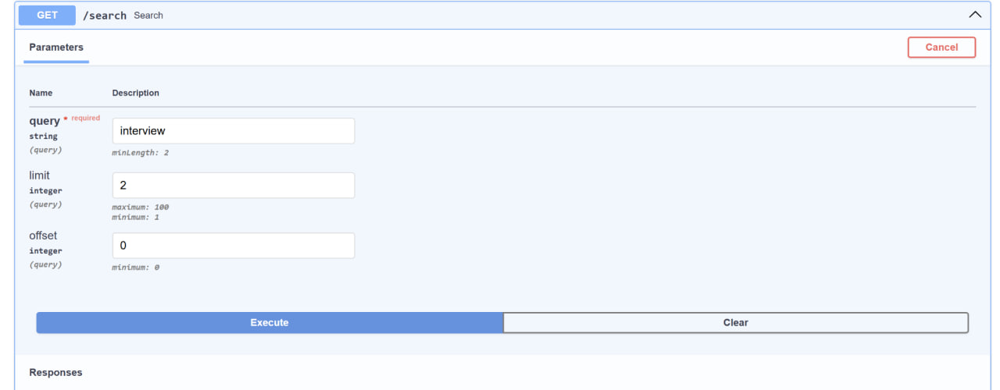
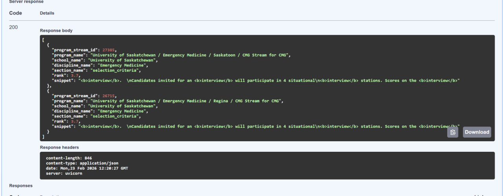

# CaRMS Mini Data Platform

A small, dockerized **ETL + API** project built with **PostgreSQL + Dagster + FastAPI** using the CaRMS program description dataset (iteration **1503**).

## What this project includes
- A reproducible local stack via Docker Compose (Postgres + Dagster + FastAPI)
- ETL implemented in Dagster as an **assets graph** (read → extract id → join → prepare → load)
- FastAPI endpoints for listing programs and running keyword search (Swagger UI)

## Screenshots

### Dagster (ETL as assets)





### FastAPI (Swagger)









## Architecture
Services (Docker Compose):
- **postgres** (DB) → `localhost:5432`
- **dagster_webserver** (UI) → `http://localhost:3000`
- **dagster_daemon** (runs scheduled/queued work)
- **api** (FastAPI) → `http://localhost:8000`

High level flow:
1) Place raw files in `data/raw/`
2) Start the stack (`docker compose up -d --build`)
3) Materialize the ETL assets (via `etl_assets_job`) to load data into Postgres
4) Query/search via FastAPI endpoints

## Data inputs 
Put these files in `data/raw/`:
- `1503_discipline.xlsx`
- `1503_program_master.xlsx`
- `1503_program_descriptions_x_section.csv`

> Note: `data/raw/*` is ignored by git.

## Quickstart

### 1) Configure environment
```bash
cp .env.example .env
```

### 2) Start the platform
```bash
docker compose up -d --build
docker ps
```

Open:
- Dagster UI: http://localhost:3000
- API Docs (Swagger): http://localhost:8000/docs

### 3) Run ETL
In Dagster UI:
**Jobs → etl_assets_job → Run**

Expected row counts after a successful run:
- `disciplines`: 37
- `schools`: ~398
- `program_streams`: 815
- `program_descriptions`: 815
- `program_description_sections`: ~9,000+

## Demo
1) `docker compose up -d --build`
2) Open Dagster UI → run `etl_assets_job`
3) Open API docs: http://localhost:8000/docs
4) Try:
   - `GET /programs?limit=3`
   - `GET /search?query=interview&limit=3`


